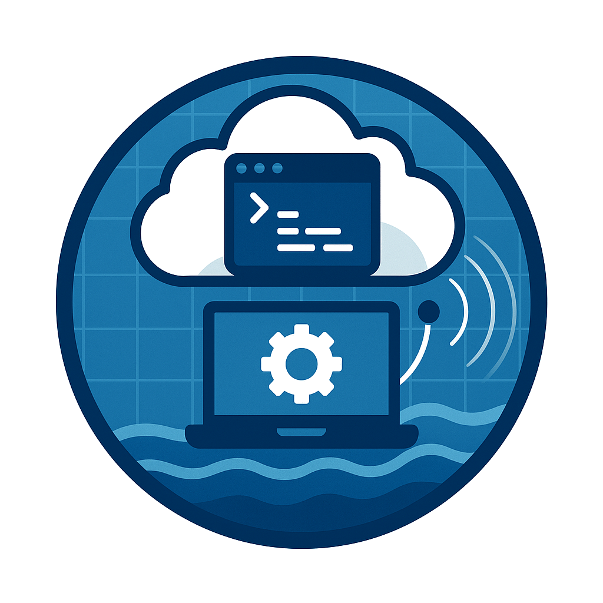
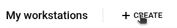
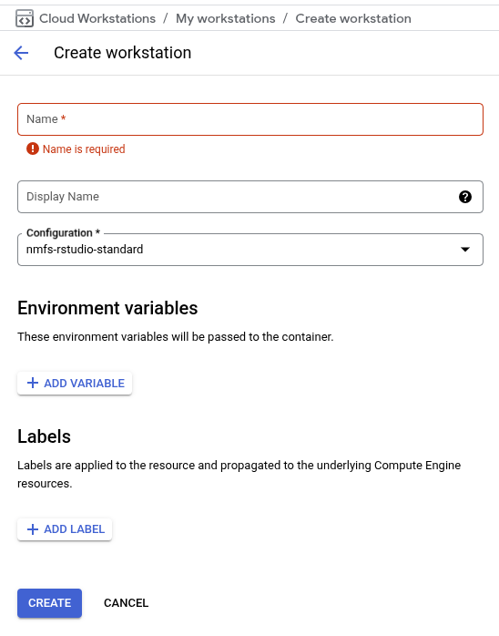
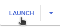
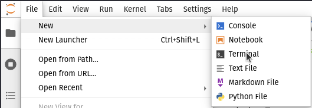
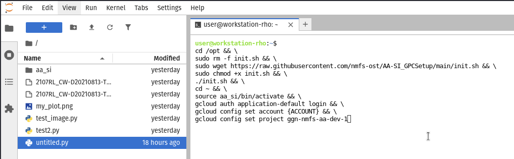

# 📘 GCP Workstation Setup Guide: **AA-SI Environment**

<p align="center">
  
</p>

Welcome! 👋 This guide will walk you through setting up a Google Cloud Platform (GCP) Workstation for use with the **AA-SI (Advanced Acoustics – Scientific Integration)** toolset. Whether this is your first time deploying a workstation or you're returning to refresh your environment, the steps below are designed to get you up and running quickly and confidently.

If you get stuck at any point, don't worry — each section includes screenshots and notes to help you along the way.

---

## ➊ Before You Begin

Before starting, please make sure you have the following:

1. **A NOAA Gmail account** that is active and accessible.
2. **Authorization to deploy GCP Workstations** hosted by NMFS – Office of Science and Technology.
   - If you don't yet have this access, please start here: [https://github.com/enterprises/noaa-nmfs](https://github.com/enterprises/noaa-nmfs)

> 💡 **Two important values you'll need later:**
> - **Your Account** → your full NOAA email address (e.g., `first.last@noaa.gov`). This is what you'll substitute for `{{ACCOUNT}}` in the commands below.
> - **The Project ID** → `ggn-nmfs-aa-dev-1`. This is the shared AA-SI project — you do not need to change or create it. Just use it exactly as written.
>
> These two are commonly mixed up, so it helps to keep them straight from the start: **Account = you**, **Project = the shared AA-SI workspace**.

---

## ➋ GCP Workstation Configuration

### 1. Navigate to the GCP Workstations Console

Open your browser and go to: [https://console.cloud.google.com/workstations/overview](https://console.cloud.google.com/workstations/overview)

---

### 2. Create a Workstation

Use the interface to configure and deploy a new workstation.



---

### 3. Choose a Name, Display Name, and JupyterLab Configuration

Pick something descriptive so you can easily find your workstation later.



---

### 4. Launch the Workstation

Once your workstation is created, go ahead and launch it.



---

### 5. Open the Terminal

Start a terminal session inside your running GCP workstation. This is where the rest of the setup happens.



---

## ➌ Environment Initialization

### 1. Run the Initialization Script

This single command will:

- Download and run the AA-SI setup script
- Assign execution permissions
- Activate the Python virtual environment
- Start GCP authentication

Copy and paste the following into your terminal — but **first, replace `{{ACCOUNT}}` with your NOAA email address** (e.g., `first.last@noaa.gov`):

```bash
cd && \
sudo rm -f init.sh && \
sudo wget https://raw.githubusercontent.com/nmfs-ost/AA-SI_GPCSetup/main/init.sh && \
sudo chmod +x init.sh && \
./init.sh && \
cd ~ && \
source venv312/bin/activate && \
gcloud auth application-default login && \
gcloud config set account {{ACCOUNT}} && \
gcloud config set project ggn-nmfs-aa-dev-1
```

> 📌 **Heads up — the two most common points of confusion:**
> - `{{ACCOUNT}}` → **replace this** with your NOAA email (your personal account).
> - `ggn-nmfs-aa-dev-1` → **leave this exactly as is**. It's the shared AA-SI Project ID, not something you create or change.



---

### 2. Reactivating the Environment Later

Any time you return to your workstation, you can jump back into the AA-SI environment with:

```bash
source venv312/bin/activate
```

> 🐍 **Why `venv312`?** Python 3.12 is the most optimized and tested version for the AA-SI toolset, which is why we've standardized on it.

---

### 3. Complete GCP Authentication

After running the initialization script, follow the browser prompts to authenticate using your NOAA credentials. A link will appear in your terminal that walks you through a Google email–based sign-in flow — this is where your NOAA email account is required.

If your session times out or you need to re-authenticate, just run:

```bash
gcloud auth application-default login && \
gcloud config set account {{ACCOUNT}} && \
gcloud config set project ggn-nmfs-aa-dev-1
```

(Same rule as before: replace `{{ACCOUNT}}` with your NOAA email, leave the project ID alone.)

---

## ➍ Using the AA-SI Toolset

### View Available Tools

Once your environment is active, you can explore the full suite of AA-SI functionalities by running:

```bash
aa-find
```

This will list everything available to you. From here, you're ready to start working! 🎉

---

## ➎ Disclaimer

This repository is a scientific product and is not official communication of the National Oceanic and Atmospheric Administration, or the United States Department of Commerce. All NOAA GitHub project code is provided on an 'as is' basis and the user assumes responsibility for its use. Any claims against the Department of Commerce or its bureaus stemming from the use of this GitHub project will be governed by all applicable Federal law. Reference to specific commercial products, processes, or services by service mark, trademark, manufacturer, or otherwise does not imply endorsement or favoring by the Department of Commerce. Use of DOC seals or logos shall not suggest endorsement by DOC or the U.S. Government.
