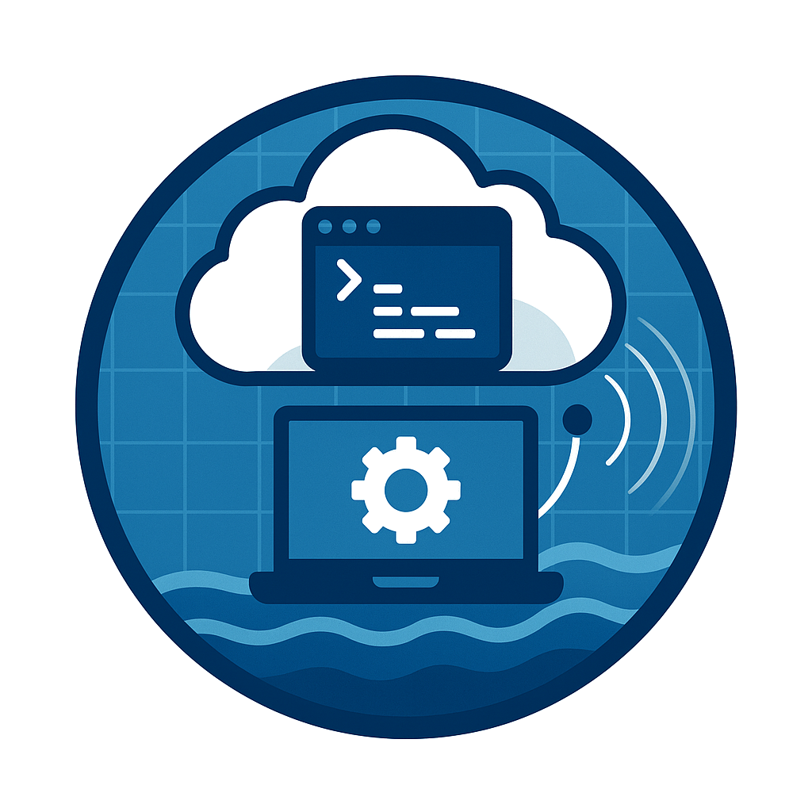

# 📘 GCP Workstation Setup Guide: **AA-SI Environment**

<p align="center">
  
</p>

This guide provides step-by-step instructions to set up a Google Cloud Platform (GCP) Workstation for use with the **AA-SI (Advanced Acoustics - Scientific Integration)** toolset.

---

## ➊ Setup Prerequisites

This setup assumes:

1. You maintain a NOAA Gmail account.
2. You are authorized to deploy GCP Workstations hosted by NMFS - Office of Science and Technology. If you do not have this set up navigate to : [https://github.com/enterprises/noaa-nmfs](https://github.com/enterprises/noaa-nmfs)

---

## ➋ GCP Workstation Configuration

### 1. Navigate to GCP Workstations Console

Open your browser and go to: [https://console.cloud.google.com/workstations/overview](https://console.cloud.google.com/workstations/overview)

---

### 2. Create a Workstation

Use the interface to configure and deploy a new workstation:


### 3. Choose name, display name and jupyter Lab configuration


---

### 4. Launch the Workstation

Once your workstation is created, launch it:


---

### 5. Open the Terminal

Start a terminal session within your running GCP workstation:


---

## ➌ Environment Initialization

### 5. Run Initialization Script

This script will:

- Download and run the AA-SI setup script
- Assign execution permissions
- Activate the Python virtual environment
- Start GCP authentication

Paste the following into your terminal:

```bash
cd && \
sudo rm -f init.sh && \
sudo wget https://raw.githubusercontent.com/nmfs-ost/AA-SI_GPCSetup/main/init.sh && \
sudo chmod +x init.sh && \
./init.sh && \
cd ~ && \
source venv312/bin/activate && \
gcloud auth application-default login && \
gcloud config set account {{ACCOUNT}} && \
gcloud config set project ggn-nmfs-aa-dev-1
```

**Note:** Replace `{{ACCOUNT}}` with your NOAA Google account email.


---

### 6. Reactivate the Environment Later

You can return to the AA-SI environment at any time by running:

```bash
source venv312/bin/activate
```

Understand that python312 is a the most optimized python version for our aa-si tool. 

### 7. Start GCP authentication
Follow browser prompts to authenticate via your NOAA credentials. A Link will be provided in the terminal and it will carry you throiugh a process of google email based authentication. THis is where your Noaa email account will be required. If your session times out restart it :

```bash
gcloud auth application-default login && \
gcloud config set account {{ACCOUNT}} && \
gcloud config set project ggn-nmfs-aa-dev-1
```

---

## ➍ Using the AA-SI Toolset

### 1. View Available Tools

To explore our suite of functionalities run

```bash
aa-find
```

---

## ➎ Disclaimer

This repository is a scientific product and is not official communication of the National Oceanic and Atmospheric Administration, or the United States Department of Commerce. All NOAA GitHub project code is provided on an ‘as is’ basis and the user assumes responsibility for its use. Any claims against the Department of Commerce or its bureaus stemming from the use of this GitHub project will be governed by all applicable Federal law. Reference to specific commercial products, processes, or services by service mark, trademark, manufacturer, or otherwise does not imply endorsement or favoring by the Department of Commerce. Use of DOC seals or logos shall not suggest endorsement by DOC or the U.S. Government.
